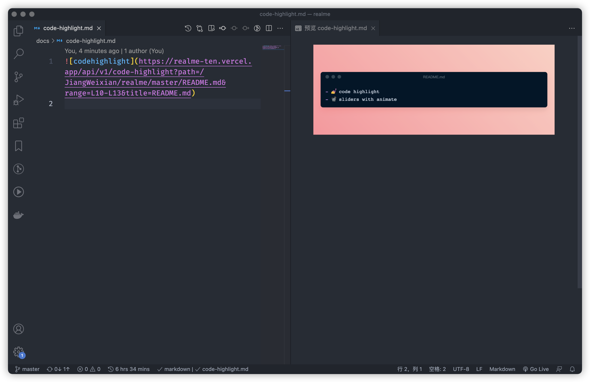
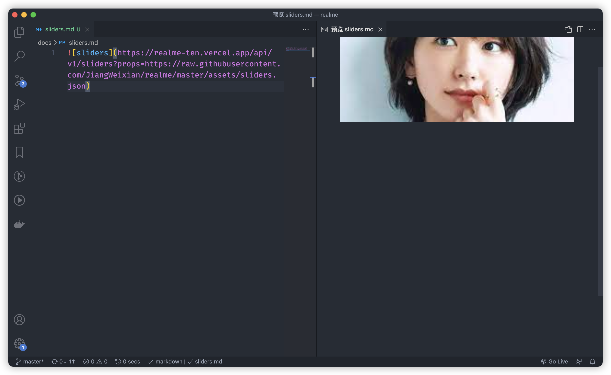

_github readme component api kit_

## features

- 💅 code highlight
- 📽 sliders with animate

## usage

### `code-highlight`

  
_▲ code-highlight_

  
params

|  name  | description                                                                                                                 |  type  |   default    | required |
| :----: | :-------------------------------------------------------------------------------------------------------------------------- | :----: | :----------: | :------- |
| title  | code highlight title                                                                                                        | string |  Untitled-1  | false    |
|  url   | file remote raw url                                                                                                         | string |      -       | true     |
|  path  | file remote path, without github raw prefix, etc `/JiangWeixian/realme/master/README.md`                                    | string |      -       | true     |
| range  | line number range, etc `L17-L20`                                                                                            | string |      -       | true     |
| height | image height                                                                                                                | number |      -       | false    |
|   bg   | background web-gradients type, etc `Warm Flame`, you can find all kinds of `webgradients` [here](https://webgradients.com/) | string | `Warm Flame` | false    |

### `sliders`

  
_▲ sliders_

  
params

| name  | description                 |  type  | default | required |
| :---: | :-------------------------- | :----: | :-----: | :------- |
| props | siders props remote raw url | string |    -    | true     |

